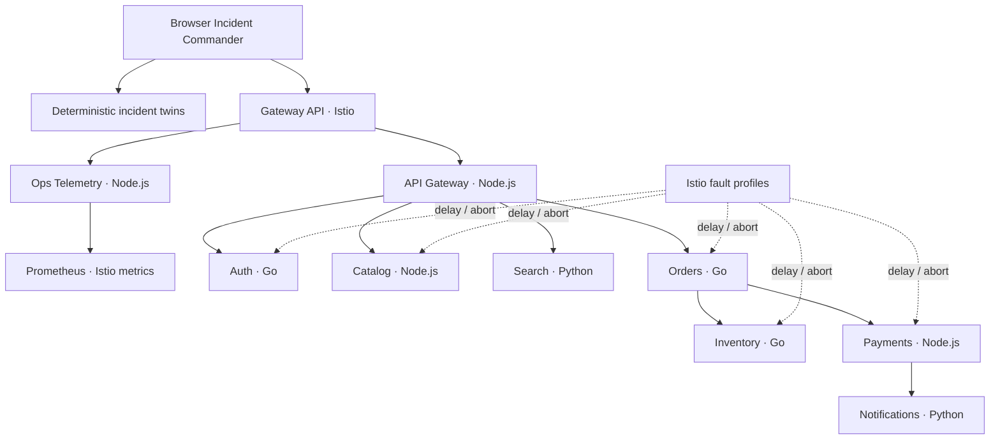

# MeshOps

**Service Mesh Incident Commander**

[](CHANGELOG.md)
[](https://github.com/fuhrdan/MeshOps/actions/workflows/ci.yml)
[](LICENSE)

MeshOps is an interactive SRE simulator built around a real polyglot microservice system. Operate a continuous checkout stream, inspect Istio service-mesh health, investigate production symptoms, identify root causes, and recover from controlled failures.

Version **1.0.1** adds a clean start screen and a six-step, Explain-Like-I'm-Five tutorial before the full Incident Commander campaign. New operators can learn the basic mental model in about 90 seconds, while experienced users can open the command console immediately.

## Engineering Evidence

MeshOps combines an interactive incident-training surface with a runnable service-mesh lab. The browser experience is deterministic and safe to explore, while the repository also contains the Kubernetes/Istio infrastructure, services, telemetry, fault profiles, and operational tooling used by the real mesh.

| Area                       | Evidence                                                                                                                                                                                         |
| -------------------------- | ------------------------------------------------------------------------------------------------------------------------------------------------------------------------------------------------ |
| **System architecture**    | [Architecture](docs/architecture.md) · [Service mesh](docs/service-mesh.md)                                                                                                                      |
| **Design decisions**       | [Architecture Decision Records](docs/adr/) covering service boundaries, Istio security, incident twins, traffic engineering, progressive delivery, tracing, resilience, and zero-trust exercises |
| **Incident engineering**   | [Incident engine](docs/incident-engine.md) · [Traffic engineering](docs/traffic-engineering.md)                                                                                                  |
| **Distributed tracing**    | [OpenTelemetry tracing](docs/distributed-tracing.md) with service waterfalls and first-failing-span investigation                                                                                |
| **Progressive delivery**   | [Canary Commander](docs/canary-commander.md) with staged traffic, guardrails, promotion, hold, and rollback                                                                                      |
| **Resilience engineering** | [Resilience game days](docs/resilience-engineering.md) with bounded load testing and failure scenarios                                                                                           |
| **Zero trust / chaos**     | [Security and chaos exercises](docs/zero-trust-chaos.md) covering identity, authorization, egress, segmentation, and bounded fault injection                                                     |
| **Full SRE campaign**      | [Incident Commander campaign](docs/incident-commander-campaign.md) combining diagnosis, mitigation, tracing, resilience, identity containment, and after-action reporting                        |

### Simulation Boundary

MeshOps deliberately separates the **browser incident simulator** from the **real service-mesh lab**.

The static browser build does not claim to be connected to a live Kubernetes cluster. It provides deterministic incident twins for safe investigation and training.

The repository's real lab uses the polyglot services, Kubernetes, Istio, strict mTLS, workload identity, telemetry, traffic controls, and fault-injection tooling.

That distinction keeps demonstrations reproducible without presenting simulated telemetry as production evidence.

## Take the quick tutorial

1. Choose **Quick tutorial** on the cover screen.
2. Meet the small services that cooperate to process one checkout.
3. See how the service mesh creates safe hallways between them.
4. Learn the difference between an incident symptom and its root cause.
5. Follow a distributed trace to the first failing service.
6. Preview safe recovery controls, then enter the real console.

The walkthrough uses plain language, simple pictures, and no quiz or setup. Choose **Open command console** at any time to skip it.

## Complete the Incident Commander campaign

1. Recover checkout from a payment latency incident in Commander mode.
2. Stop an unsafe canary at its first failed guardrail.
3. Confirm the first failing span in an error trace.
4. Prove a minimal resilience design under a bounded load test.
5. Contain a stolen workload identity with zero remaining blast radius.
6. Export the final Markdown after-action report.

Campaign progress is deterministic and local to the browser. The static itch.io build never connects to or mutates a Kubernetes cluster.

## Command a trust-boundary exercise

1. Choose a zero-trust probe or bounded chaos scenario.
2. Arm the scenario and inspect its potential blast radius.
3. Select transport, identity, authorization, egress, segmentation, or availability defenses.
4. Execute the probe and inspect blocked traffic, encryption coverage, and remaining reach.
5. Refine breached designs without accumulating unnecessary privilege.

## Run a resilience game day

1. Choose a dependency, retry, replica, zone, saturation, or cache failure.
2. Inject the fault and inspect the unprotected customer impact.
3. Select the smallest effective protection set.
4. Run the bounded load test.
5. Compare before/after guardrails and refine failed designs.

## Investigate a distributed trace

1. Search by trace ID, request, or scenario, or filter to slow/error traces.
2. Select a checkout to open its service waterfall.
3. Compare proportional span timings to identify the critical path.
4. Inspect a span's parent, operation, HTTP status, semantic attributes, and events.
5. Use **Capture current trace** to correlate the active incident or canary rollout.

## Command a canary rollout

1. Choose a release-regression scenario and target service.
2. Start with 5% canary traffic.
3. Compare success rate and P50/P95/P99 latency against stable.
4. Promote one stage, hold for investigation, or roll back.
5. Failed guardrails block unsafe promotion.
6. Complete the 100% stage, then promote the canary to stable.

## Try the v0.5.0 incident loop

1. Choose one of five controlled failure scenarios.
2. Select **Guided**, **Standard**, **Senior**, or **Commander** difficulty.
3. Inject the failure and watch request rate, success rate, P95 latency, service health, objectives, and events degrade.
4. Investigate the topology and available clues, then commit to a root-cause diagnosis.
5. Incorrect calls cost operational score. A correct diagnosis unlocks traffic engineering.
6. Configure retries, a bounded timeout, and optional canary traffic, then apply and observe.
7. Remove the injected fault only after mitigation is verified.

Traffic controls model tradeoffs rather than promising a universal fix: retries can amplify load, aggressive timeouts can reject slow successes, and larger canary weights increase blast radius.

## Architecture



Every application pod is enrolled through namespace injection and gets an Envoy sidecar. Istio provides strict mTLS, workload identity, authorization policy, uniform metrics, and controlled HTTP fault injection.

| Service | Runtime | Responsibility |
|---|---|---|
| `api-gateway` | Node.js | Request entry point and checkout orchestration |
| `auth` | Go | Identity validation |
| `catalog` | Node.js | Deterministic product data |
| `search` | Python | Product search |
| `orders` | Go | Order workflow and downstream coordination |
| `inventory` | Go | Stock reservation |
| `payments` | Node.js | Payment authorization |
| `notifications` | Python | Event notification acceptance |
| `ops-telemetry` | Node.js | Prometheus query and streaming adapter |

## Incident catalog

| Fault ID | Target | Real Istio behavior |
|---|---|---|
| `payments-latency` | payments | 650 ms delay on 100% of requests |
| `inventory-errors` | inventory | HTTP 503 abort on 45% of requests |
| `catalog-brownout` | catalog | 420 ms delay on 40% plus HTTP 503 on 15% |
| `auth-failure` | auth | HTTP 503 abort on 55% of requests |
| `orders-latency` | orders | 900 ms delay on 60% of requests |

The browser models the user-visible production impact of these profiles rather than claiming that static itch.io telemetry came from a live cluster.

## Run the browser build

Requirements: Node.js 22 or newer.

```bash
npm ci
npm test
bash scripts/package-itch.sh
```

The static export is written to `dist/client`. The packaging script creates `release/MeshOps-v1.0.1-itch.zip`.

## Run the real mesh

Requirements: Docker, kind, kubectl, Helm 3, and `istioctl` 1.31.

```bash
kind create cluster --config deploy/kind/cluster.yaml
bash scripts/install-mesh.sh
kubectl -n meshops get gateway,httproute,pods
```

Apply a real incident after the mesh is healthy:

```bash
bash scripts/incident.sh list
bash scripts/incident.sh apply payments-latency
bash scripts/incident.sh status
bash scripts/incident.sh clear
```

Only one MeshOps-managed incident fault is kept active by `scripts/incident.sh` at a time. This makes exercises repeatable and prevents stale training faults from overlapping unexpectedly.

To run the services without a mesh, use Docker Compose:

```bash
docker compose up --build
curl http://localhost:8080/api/checkout
```

See [Getting started](docs/getting-started.md), [Service mesh](docs/service-mesh.md), and [Incident engine](docs/incident-engine.md).
See also [Traffic engineering](docs/traffic-engineering.md).
See [Canary Commander](docs/canary-commander.md) for the progressive-delivery lab.
See [Distributed tracing](docs/distributed-tracing.md) for the browser and real-mesh trace pipeline.
See [Resilience Engineering](docs/resilience-engineering.md) for game-day protections and load testing.
See [Zero Trust and Chaos](docs/zero-trust-chaos.md) for security layers and chaos safety gates.
See [Full Incident Commander campaign](docs/incident-commander-campaign.md) for mission contracts, ranks, and the real-lab companion.
See [Quick-start tutorial](docs/quick-start-tutorial.md) for the cover-screen choices and walkthrough copy.

## Repository map

```text
meshops/
├── app/                         # Browser operations + incident console
├── services/                    # Eight business services + telemetry adapter
├── deploy/
│   ├── istio/
│   │   ├── faults/              # Five v0.4.0 controlled fault profiles
│   │   ├── canary/              # v0.6 stable/canary workloads and routing
│   │   ├── gateway/             # Gateway API integration
│   │   ├── policies/            # mTLS + authorization
│   │   ├── routes/              # HTTPRoute ingress
│   │   └── telemetry/           # Mesh telemetry configuration
│   ├── observability/           # Prometheus collection stack
│   │                             # OpenTelemetry Collector and Tempo
│   ├── loadtest/                # Bounded Fortio resilience test
│   ├── chaos/                   # Safety-gated Chaos Mesh profiles
│   ├── kind/                    # Local cluster definition
│   └── kubernetes/              # Helm chart, identities, sidecars
├── docs/                        # Architecture, setup, ADRs, incident guide
├── scripts/                     # Install, incident, verify, validate, package
├── tests/                       # UI and repository contract tests
├── .github/workflows/           # Continuous integration
└── docker-compose.yml
```

## v1.0.1 capabilities

- Clean cover screen with a clear tutorial-or-console choice
- Six-step Explain-Like-I'm-Five service-mesh walkthrough
- Clickable lesson rail, previous/next controls, progress dots, and skip route
- One-click handoff from the tutorial into the unchanged operations console

- Five-operation Incident Commander campaign across every major console discipline
- Objective-gated progression with separate campaign scoring and four certification ranks
- Mission workspace handoff into the established incident, canary, trace, resilience, and trust labs
- Confirmable failing-span evidence for incident review
- Exportable local Markdown after-action report
- Read-only campaign runbook for real-lab briefing, preflight, and status

- Continuous traffic with pause, single-step, and 1×/2×/4× speeds
- Animated request hops and selectable service topology
- Request rate, success rate, P95 latency, CPU, workload readiness, and SLO status
- Five selectable deterministic production failures
- Four difficulty levels with progressively fewer investigation clues
- Root-cause decisions with explicit wrong-call score penalties
- Difficulty/time/error-weighted recovery scoring
- Filterable incident, request, mesh, and Kubernetes event timeline
- Five real Istio fault manifests matching the browser scenarios
- `scripts/incident.sh` for repeatable apply/status/clear exercises
- Prometheus snapshot and Server-Sent Events API for cluster-backed telemetry
- Retry-budget, request-timeout, and weighted-canary simulation controls
- Apply-and-observe verification before incident recovery
- Real Istio traffic-policy manifests and lifecycle script
- Five-stage canary promotion with hold and rollback
- Automated success and percentile-latency guardrails
- Six progressive-delivery failure scenarios
- Real stable/canary workload and Istio routing lab
- Trace search and slow/error filtering
- Proportional distributed-span waterfall and span inspector
- Incident/canary trace correlation
- W3C trace-context propagation
- OpenTelemetry Collector and Tempo training stack
- Six controlled resilience experiments
- Circuit breaker, outlier ejection, bulkhead, timeout, retry-budget, and fallback design
- Before/after customer-impact guardrails and resilience scoring
- Istio and Kubernetes resilience policies with bounded load testing
- Seven trust-boundary and chaos command scenarios
- Layered transport, identity, authorization, egress, and segmentation controls
- Blast-radius and least-privilege scoring
- Safety-gated Chaos Mesh profiles

## Release roadmap

| Version | Milestone | Status |
|---|---|---|
| v0.1.0 | Production system and request tracing | **Released** |
| v0.2.0 | Istio mesh, mTLS, Gateway API | **Released** |
| v0.3.0 | Live operations console | **Released** |
| v0.4.0 | Incident engine and fault injection | **Released** |
| v0.5.0 | Traffic engineering controls | **Released** |
| v0.6.0 | Canary Commander | **Released** |
| v0.7.0 | OpenTelemetry tracing | **Released** |
| v0.8.0 | Resilience engineering | **Released** |
| v0.9.0 | Zero trust and chaos | **Released** |
| v1.0.0 | Full Incident Commander campaign | **Released** |
| v1.0.1 | Cover screen and quick-start tutorial | **Released** |

## Contributing

Read [CONTRIBUTING.md](CONTRIBUTING.md) for local checks, branch conventions, and the definition of done. Architectural decisions are recorded under [`docs/adr`](docs/adr).

## License

MIT License. See [LICENSE](LICENSE).
