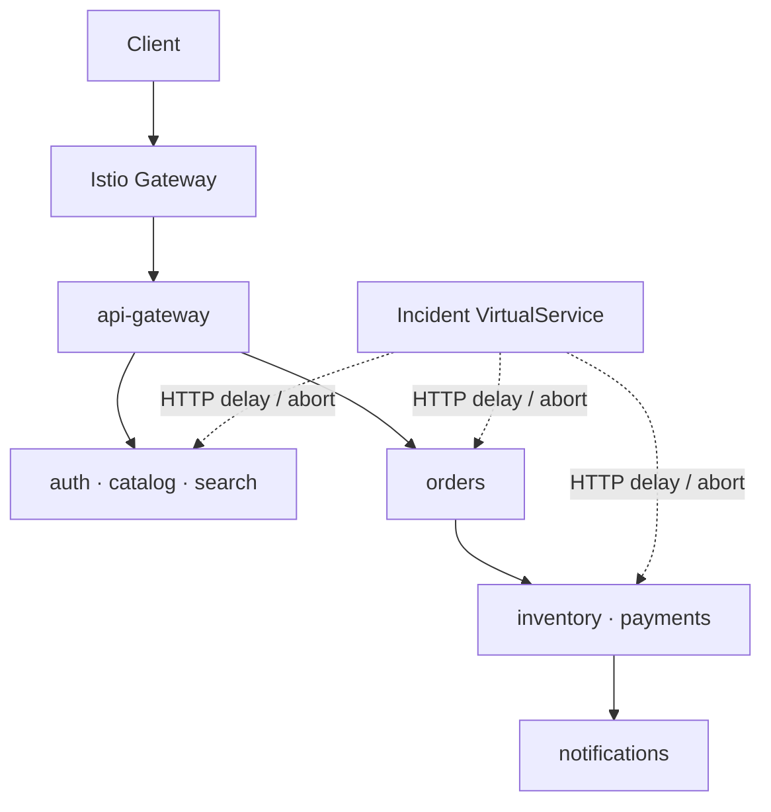

# Architecture

MeshOps has two execution surfaces that model the same checkout system and the same v0.4.0 incident catalog.

## Browser simulation

The itch.io-compatible console is a deterministic client-side simulation. It drives the simulation clock, request hops, RED metrics, objectives, events, score, and incident state without pretending that a static browser is querying a live cluster.

The v0.4.0 Incident Engine adds five deterministic incident twins and this state machine:

```text
idle -> active -> diagnosed -> recovered
          |            |
          |            +-- controlled fault removal
          +-- incorrect diagnosis -> score penalty
```

Four difficulty levels control how many investigation clues are exposed. The underlying metrics and topology remain available at every level.

## Runnable service mesh

The Kubernetes environment executes the same conceptual transaction through real HTTP calls:

1. A Kubernetes Gateway API `Gateway` provisions an Istio data-plane gateway.
2. An `HTTPRoute` sends requests to `api-gateway`.
3. The gateway calls `auth`, `catalog`, `search`, and `orders`.
4. `orders` calls `inventory` and `payments`.
5. `payments` calls `notifications`.
6. Prometheus scrapes the merged Istio metrics endpoint on every application pod.
7. `ops-telemetry` queries Prometheus and exposes snapshots or an SSE stream.
8. A v0.4 incident `VirtualService` can inject a controlled delay or HTTP abort on one internal service host.

Every service has its own Kubernetes ServiceAccount. Istio derives a SPIFFE identity in the form `cluster.local/ns/meshops/sa/<service>` and uses it for mTLS authentication and authorization.



## Policy layers

| Layer | Resource | Contract |
|---|---|---|
| Enrollment | Namespace label | Every application pod receives an Envoy sidecar |
| Identity | ServiceAccount | Every service has a distinct workload identity |
| Authentication | `PeerAuthentication` | All in-mesh traffic requires mTLS |
| TLS origination | `DestinationRule` | Clients use `ISTIO_MUTUAL` for service destinations |
| Authorization | `AuthorizationPolicy` | Only callers in the documented graph are allowed |
| Ingress | `Gateway` + `HTTPRoute` | External HTTP reaches only approved backends |
| Collection | Prometheus | Merged application and Envoy metrics are scraped every 10 seconds |
| Adapter | `ops-telemetry` | RED metrics are exposed as JSON snapshots and SSE |
| Telemetry | `Telemetry` | Prometheus metrics and Envoy access logs are enabled |
| Incident injection | `VirtualService` | Training-only delay/abort behavior is scoped to one service host |
| Progressive delivery | `Deployment` + `DestinationRule` + `VirtualService` | Stable/canary subsets receive guarded weighted traffic |
| Trace collection | Istio + OpenTelemetry Collector | W3C-correlated spans are batched through OTLP |
| Trace storage | Tempo | Local training traces are queryable for 24 hours |
| Resilience | Istio + Kubernetes | Connection limits, endpoint ejection, disruption budgets, autoscaling, and topology spread contain failures |
| Zero trust | Istio + NetworkPolicy | JWT, SPIFFE, mTLS, authorization, egress, and segmentation bound service reach |
| Chaos | Chaos Mesh | Explicitly confirmed, lab-only disruptions validate containment |

## Operational contracts

- Port `8080` inside every container
- `GET /health` returns JSON and HTTP 200
- `X-Request-Id` is propagated on every internal call
- Application logs are JSON or JSON-shaped single-line records
- Readiness and liveness probes are independent of business routes
- Application and sidecar readiness are both visible
- Resource requests and limits exist for every Kubernetes workload
- v0.4 incident faults carry `app.kubernetes.io/component: incident-fault`
- `scripts/incident.sh` keeps at most one MeshOps-managed incident profile active

Version 0.9.0 layers adversarial trust probes and safety-gated chaos onto the resilience foundation. Operators must contain threats with the smallest justified policy set and can see the blast radius of missing controls.

Version 1.0.0 adds a campaign controller above the existing browser state machines. It configures one canonical scenario per discipline, observes explicit completion contracts, carries forward campaign score, and produces a local after-action report. The campaign layer never bypasses or duplicates the underlying controls.
